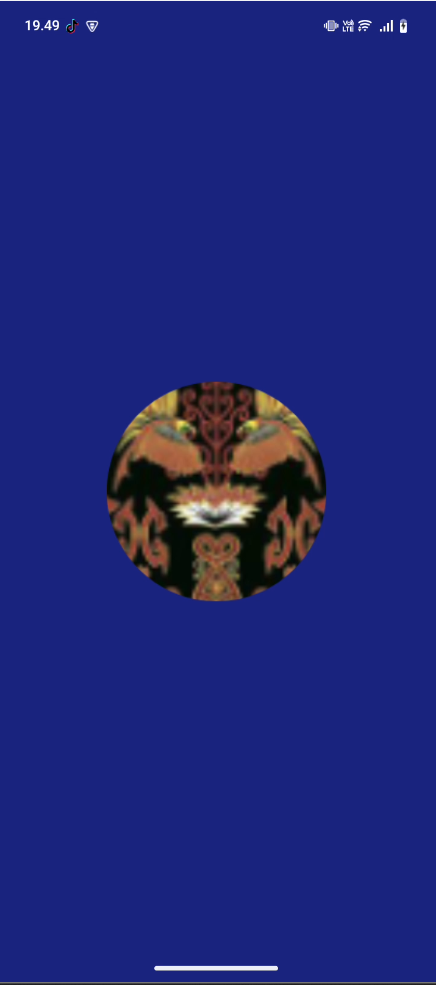
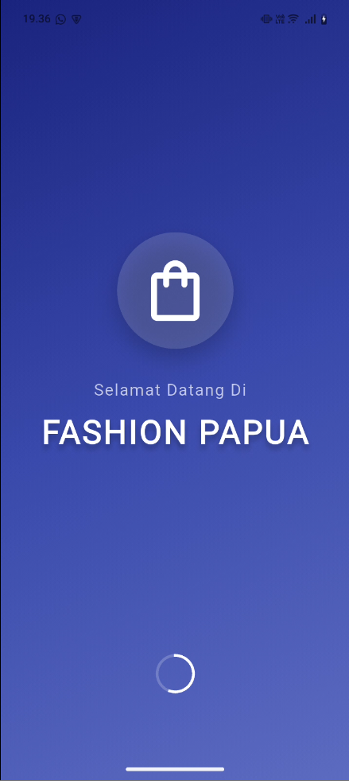
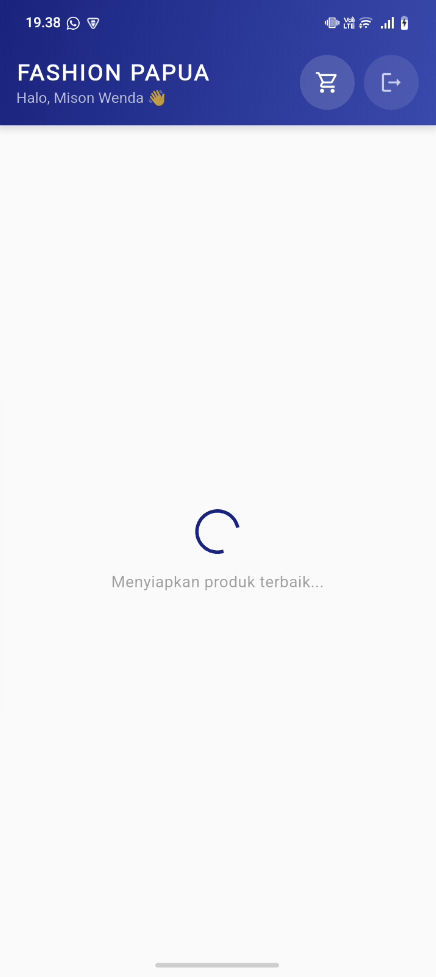
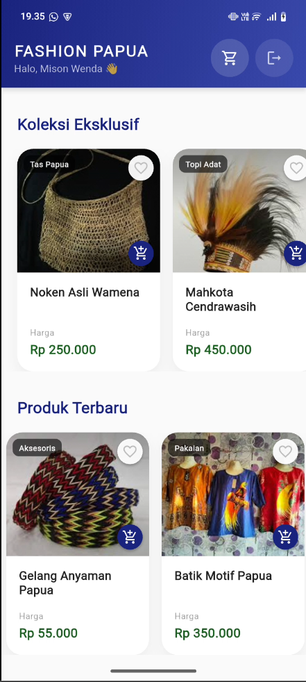
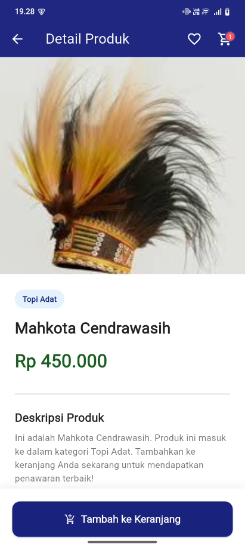
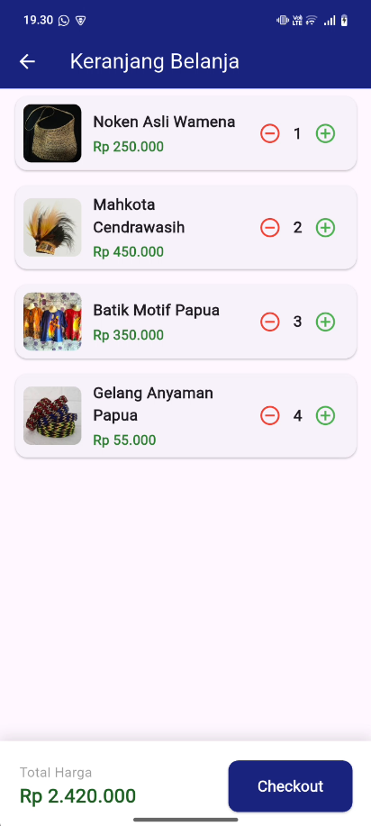
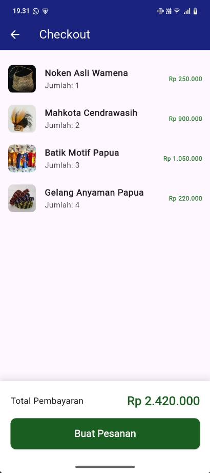
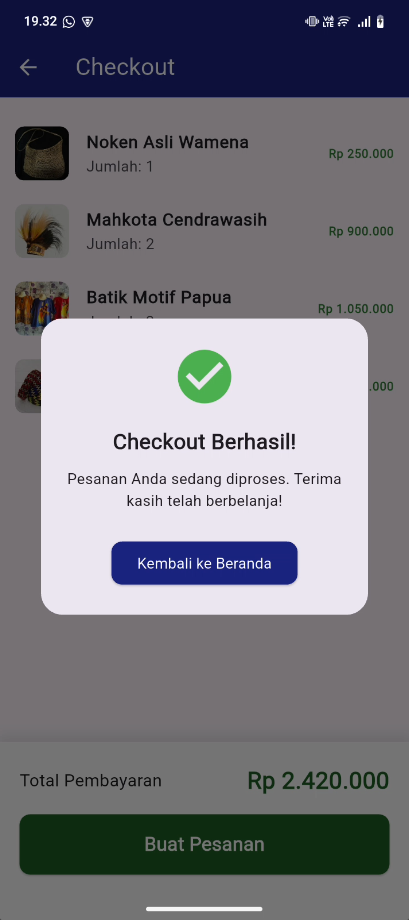

# Fashion Papua 

Nama : Mison Wenda
NIM : 1123150103
Kelas : TI SE 23 P2 
Mata Kuliah : Pemrograman Mobile Lanjutan

## Link Youtube Presentasi

- [Presentasi](https://youtu.be/Ffg01Nc8iTc)

- [link firebase console](https://console.firebase.google.com/u/0/project/pasar-malam-b924a/overview?hl=id)

## Hasil tampilan aplikasi

